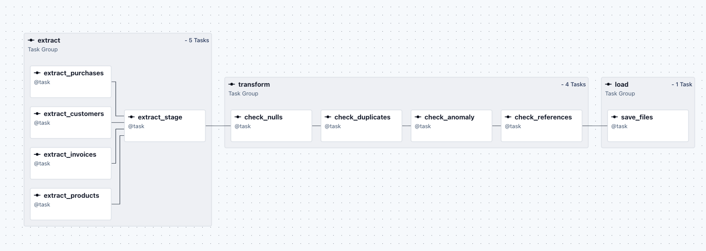

**1.py** — задачі по Python.  
Тут зібрані різні підходи до обробки даних, які були виконані для вивчення даних, які далі будуть систематизовані в Airflow.  
У папці `1.py/sources` знаходяться вхідні джерела даних.
Data Quality Check:

- check nulls: тільки soft пошук NULL, без змінення даних у dim та fact, бо не знаю бізнес модель, і чи NULL допустимі чи ні, тому їх залишив, якщо треба - можу змінити
- check duplicates: пошук дуплікатів по PK, i при виявленні - keep "Last" по subset PK.
- check anomaly: перевірка, що 0 < ціна_invoice < ціна_products, тільки перевірка, без видалення даних, але зі створенням колонки флагу (valid/invalid)
- check_custom (referencial): перевірка на цілісність даних, між dim та fact (fail - якщо є невідповідність, true - у протилежному)

Invoices, Purchases - не об'єднував у 1 таблицю факту, працював як з 2 різними джерелами, якщо треба - можу змінити

**2.sql** — задачі по SQL.  
Результат виконання `1.py` зберігається у: 2.sql/sources/\*.csv - ці файли використовуються як джерело для завантаження даних у таблиці, створені через DDL.

**3.airflow** — задачі по Airflow (систематизований підхід на Python).  
Містить `docker-compose.yaml` з налаштованими volumes та DAG з pipeline:

- extract
- transform
- load

Структура задач у DAG:

**5.2 Ідемпотентність**

Повторний запуск не призводить до дублювання даних, оскільки:

- всі проміжні результати записуються у staging директорії та перезаписуються при кожному запуску
- nulls, дублікати, аномалії обробляються на етапі data quality checks (trasnform)
- фінальні результати записуються у loading директорії, якщо pipeline - успішний. Якщо хоч 1 джерело даних - не завантажилось, ламається весь pipeline на стадії extract

Це якщо ми говоримо про test pipeline, без завантаження у БД.

Якщо ми говоримо про Data Warehouse, я би зробив наступне:

- raw layer: завантажував наші вхідні файли + додаючи колонку load_at як системну, щоб кожен запуск pipeline - був записаний, навіть якщо це перезапуск у вигляді Views

- stage layer: для dim - робив би snapshot для збереження усіх історії змін + на основі них створення окремого довідніка з актуальними даними без дублікатів по бізнес ключам (customer_id, product_id). для fact - створив би incremental завантаження за стратегією merge по бізнес ключам, щоб не дублювати + об'єднав би invoice та purchases - у 1 факт. Ще звісно data_tests (referencial, accepted values, nulls, unique), units_test + кастомні (для перевіркі бізнес логіки)

- mart layer - повноціна модель зірка, з усієї бізнес логікою
